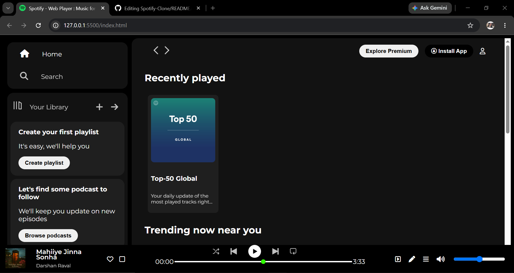

# 🎵 Spotify Clone

A responsive **Spotify Web Player UI Clone** built using **HTML** and **CSS**. This project recreates the look and feel of Spotify's web interface, including the sidebar, navigation bar, music player, playlists, and featured sections.

> **Note:** This project is created for educational purposes only and is not affiliated with Spotify.

---

## 📸 Preview



---

## ✨ Features

- 🎧 Spotify-inspired modern UI
- 📱 Responsive layout
- 🎵 Music player section
- 📚 Sidebar with library
- 🔍 Navigation bar
- 🎼 Playlist & album cards
- 📌 Sticky navigation
- 🎨 Clean and organized design

---

## 🛠️ Built With

- HTML5
- CSS3
- Font Awesome Icons
- Google Fonts (Montserrat)

---

## 📂 Project Structure

```
spotify-clone/
│── index.html
│── style.css
│── preview.png
│── README.md
└── images/
    ├── logo.png
    ├── library_icon.png
    ├── backward_icon.png
    ├── forward_icon.png
    ├── player_icon1.png
    ├── player_icon2.png
    ├── player_icon3.png
    ├── player_icon4.png
    ├── player_icon5.png
    ├── preview.png
    ├── card1img.jpeg
    ├── card2img.jpeg
    ├── card3img.jpeg
    ├── card4img.jpeg
    ├── card5img.jpeg
    └── card6img.jpeg
```

---

## ⚙️ Installation

1. Clone the repository

```bash
git clone https://github.com/stutigupta1503/Spotify-Clone.git
```

2. Open the project folder.

3. Double-click **index.html** or open it with **Live Server** in VS Code.

---

## 📌 Future Improvements

- Add JavaScript functionality
- Music playback controls
- Search functionality
- Dark/Light mode
- Responsive sidebar
- Playlist interactions
- Animations and hover effects

---

## 👩‍💻 Author

**Stuti Gupta**

GitHub: https://github.com/stutigupta1503

---

## 📄 License

This project is created for learning purposes only.
Spotify™ is a trademark of Spotify AB.

